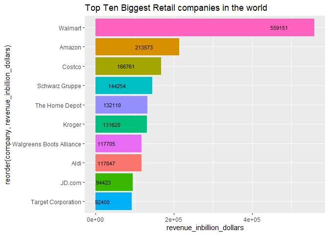

EDA BIGGEST RETAIL COMPANIES
================
francis kyalo
2023-01-30

# BIGGEST RETAIL COMPANIES IN THE WORLD

Retail companies have experienced exponential growth and boosted by the
rising demand brought about by the covid pandemic.

For this project, i will exploring data released by Delloite in 2020

``` r
# loading the required libraries 
library(datapasta)
```

    ## Warning: package 'datapasta' was built under R version 4.1.3

``` r
library(tidyverse)
```

    ## Warning: package 'tidyverse' was built under R version 4.1.3

    ## -- Attaching packages --------------------------------------- tidyverse 1.3.1 --

    ## v ggplot2 3.4.0     v purrr   0.3.4
    ## v tibble  3.1.5     v dplyr   1.0.7
    ## v tidyr   1.1.4     v stringr 1.4.0
    ## v readr   2.1.2     v forcats 0.5.1

    ## Warning: package 'ggplot2' was built under R version 4.1.3

    ## Warning: package 'readr' was built under R version 4.1.3

    ## -- Conflicts ------------------------------------------ tidyverse_conflicts() --
    ## x dplyr::filter() masks stats::filter()
    ## x dplyr::lag()    masks stats::lag()

Data will be scrapped from Wikipedia and wrangled before use

``` r
data <- data.frame(
  stringsAsFactors = FALSE,
                V1 = c(1L, 2L, 3L, 4L, 5L, 6L, 7L, 8L, 9L, 10L),
                        V2 = c("Walmart",
                               "Amazon","Costco","Schwarz Gruppe",
                               "The Home Depot","Kroger","Walgreens Boots Alliance","Aldi",
                               "JD.com","Target Corporation"),
                        V3 = c("Hypermarket/Supercenter/Superstore","Non-Store,E-commerce",
                               "Cash & Carry/Warehouse Club","Discount Store",
                               "Home Improvement","Supermarket",
                               "Drug Store/Pharmacy","Discount Store","Non-Store",
                               "Discount Department Store"),
                        V4 = c(559151,213573,
                               166761,144254,132110,131620,117705,117047,
                               94423,92400),
                        V5 = c("2.5%","5.5%",
                               "2.4%","...","9.7%","2.0%","0.3%","...",
                               "6.6%","4.7%"),
                        V6 = c("United States, Bentonville","United States, Seattle",
                               "United States, Issaquah","Germany, Neckarsulm",
                               "United States, Atlanta","United States, Cincinnati",
                               "United States, Deerfield",
                               "Germany, Essen and Mülheim","China, Beijing",
                               "United States, Minneapolis")
        )
```

I’ll start by renaming the columns

``` r
data <- data %>% rename(
  rank = V1, 
  company =V2, 
  dominant_operation_format = V3,
  revenue_inbillion_dollars = V4,
  net_profit_margin = V5,
  location = V6
)

data %>% head(5)
```

    ##   rank        company          dominant_operation_format
    ## 1    1        Walmart Hypermarket/Supercenter/Superstore
    ## 2    2         Amazon               Non-Store,E-commerce
    ## 3    3         Costco        Cash & Carry/Warehouse Club
    ## 4    4 Schwarz Gruppe                     Discount Store
    ## 5    5 The Home Depot                   Home Improvement
    ##   revenue_inbillion_dollars net_profit_margin                   location
    ## 1                    559151              2.5% United States, Bentonville
    ## 2                    213573              5.5%     United States, Seattle
    ## 3                    166761              2.4%    United States, Issaquah
    ## 4                    144254               ...        Germany, Neckarsulm
    ## 5                    132110              9.7%     United States, Atlanta

Using ggplot2 , i will create a bar graph that shows the top ten
companies by revenue

``` r
ggplot(data, aes(x= reorder(company,revenue_inbillion_dollars),
                 y =  revenue_inbillion_dollars, fill=company)) +
  geom_bar(stat = 'identity') +
  geom_text(aes(label=revenue_inbillion_dollars), hjust= 2.5, colour="black",
  size=3) +
  theme(legend.position = "none") + 
  ggtitle("Top Ten Biggest Retail companies in the world ") +
  coord_flip()
```

<!-- -->
